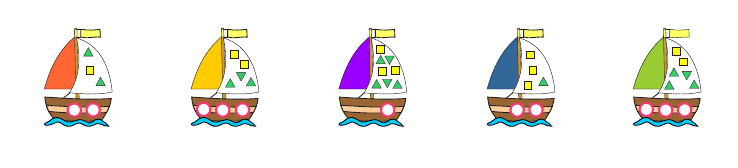
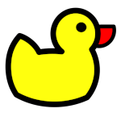

Hello!

Excited to send this first ever letter to you!

1. My boat has more than 1 circle.
It also has 2 more triangles than squares.  
**Which boat is mine?**  

2.
On one island, all inhabitants are either knights, who always tell the truth, or knaves, who always lie.
Alice and Bob are residents of the island of knights and knaves.
Alice says: We are both knaves.  
**Who is what?**

3.
You are at the party and you all are having a pizza.
You are cutting it so that everyone has one piece and nothing is left.
Everybody loves pizza and wants the biggest piece.
But you have to let everyone choose their piece first, and take the last piece.  
**How do you cut it to take the biggest possible piece to yourself in this case?**  
Answer is general (doesn't depend on the size of party or pizza shape),
but to make a concrete example, suppose there are 4 people at the party and it's a round pizza.

Send back your solutions if you want.

Enjoy the challenges!  

